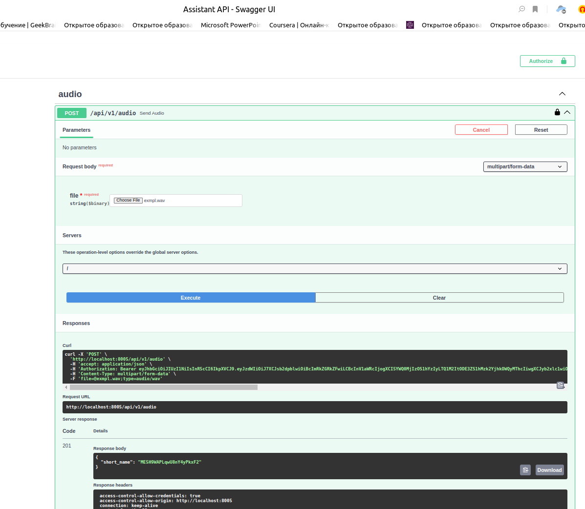
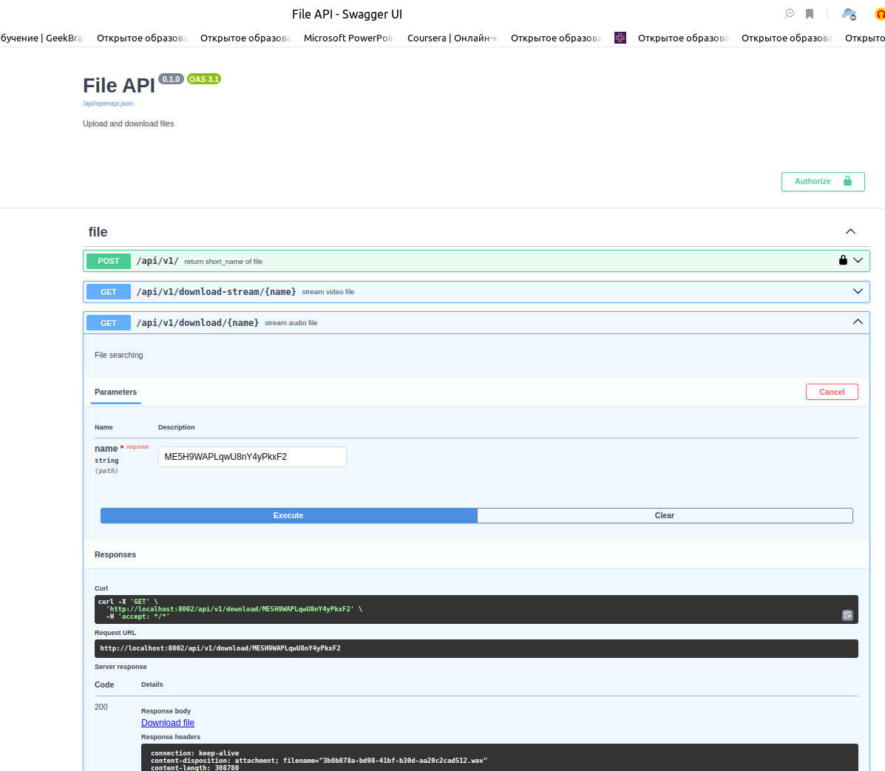
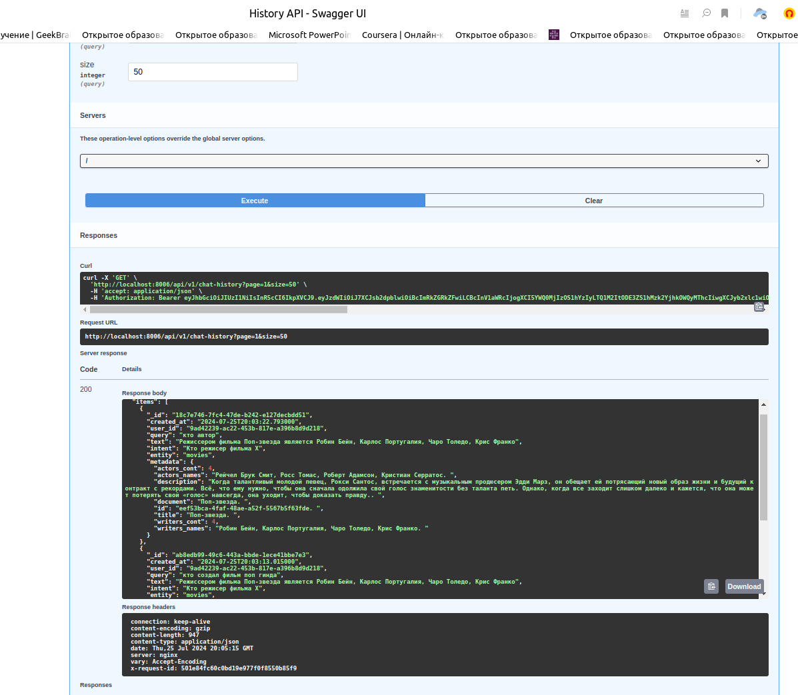

# Проектная работа: диплом
Подробное описание проекта смотрите в [документации](./docs)
### GIT: https://github.com/KseniiaKarpova/graduate_work

### Ответы на вопросы по ревью:

`etl` - взят из прошлых спринтов. Модуль **data_transfer_sqlite_to_pg** 
предназначен для того чтобы ОДИН раз перенести данные из sqlite в postgres 
(основной базой данных для контента является postgres). Нам досточно по логам получить
информацию что данные перенесли, 
поэтому дополнительный расширенный функционал мы не добавляем.
Данные берутся частями из sqlite.


## Запуск проекта:
 Для корректной работы ASR требуется подложить дополнительны файлы модели (в гите их нет)
## Step 1 (bild project)
```bash
cp env_example .env
```

```bash

docker-compose -f docker-compose.ai.yaml -f docker-compose.main.yaml -f docker-compose.etl.yaml  up --build
```

```bash
docker exec AuthAPI alembic upgrade head
docker exec file_api alembic upgrade head

```
## Step 2 (migration)
Заполнение базы данных из sqlite в Postgres

```bash
curl -XGET http://0.0.0.0:8877/migrate
```


## создание тестовой записи

**Примеры тесnовых записей лежат в** `docs/wav_example`

Чтоб записать тестовое аудио (linux):

```bash
arecord -f S16_LE exmpl.wav
```
Чтоб остановить запись: `Ctrl + C`


## Api Docs
- Auth API: http://localhost:8001/api/openapi (сервис авторизации)
- File API: http://localhost:8002/api/openapi (сервис для хранения и получения файлового хранилища)
- ASR: http://localhost:8003/api/openapi (сервис преобразования голоса в текст)
- TTS API: http://localhost:8004/api/openapi (сервис преобразования текста в аудио - отдает short_name от File API)
- Assistant API: http://localhost:8005/api/openapi (Основной сервис для взаимодействия - входная точка)
- History API: http://localhost:8006/api/openapi (сервис хранения истории - используем Монго)
- Intent API: http://localhost:8007/api/openapi (сервис логики опредления намерения по тексту)
- Text2Vec API: http://localhost:8008/api/openapi (сервис поиска и хранения тектовых данных (фильмы на русском) в векторном пространстве (база данных - Qdrant) и поиск ближайщего)
- Cinema API: http://localhost:8009/api/openapi (сервис поиска фильмов на английском (база данных - Эластик))

qdrant : http://localhost:6333/dashboard#/collections

# Пример работы:
#### аудио из `docs/wav_example`

Через `Assistant API` передаем файл, в замен полчаем имя, по которому можно выгрузить 
аудио из `File API`




Мы запустили 2 аудио, сперва где *"кто создал фильм поп звезда"*, после *"кто автор"*

По данным ниже, видно что при втором запросе ассистент понимает прошлый контекст. 


(Данные отсортированы от нового к старому)
```json
{
  "items": [
    {
      "_id": "18c7e746-7fc4-47de-b242-e127decbdd51",
      "created_at": "2024-07-25T20:03:22.793000",
      "user_id": "9ad42239-ac22-453b-817e-a396b8d9d218",
      "query": "кто автор",
      "text": "Режисcером фильма Поп-звезда является Робин Бейн, Карлос Португалия, Чаро Толедо, Крис Франко",
      "intent": "Кто режисер фильма Х",
      "entity": "movies",
      "metadata": {
        "actors_cont": 4,
        "actors_names": "Рейчел Брук Смит, Росс Томас, Роберт Адамсон, Кристиан Серратос. ",
        "description": "Когда талантливый молодой певец, Рокси Сантос, встречается с музыкальным продюсером Эдди Марз, он обещает ей потрясающий новый образ жизни и будущий контракт с рекордами. Всё, что ему нужно, чтобы она сначала одолжила свой голос знаменитости без таланта петь. Однако, когда все заходит слишком далеко и кажется, что она может потерять свой «голос» навсегда, она уходит, чтобы доказать правду.. ",
        "document": "Поп-звезда. ",
        "id": "eef53bca-4faf-48ae-a52f-5567b5f63fde. ",
        "title": "Поп-звезда. ",
        "writers_cont": 4,
        "writers_names": "Робин Бейн, Карлос Португалия, Чаро Толедо, Крис Франко. "
      }
    },
    {
      "_id": "ab8edb99-49c6-443a-bbde-1ece41bbe7e3",
      "created_at": "2024-07-25T20:03:13.015000",
      "user_id": "9ad42239-ac22-453b-817e-a396b8d9d218",
      "query": "кто создал фильм поп гинда",
      "text": "Режисcером фильма Поп-звезда является Робин Бейн, Карлос Португалия, Чаро Толедо, Крис Франко",
      "intent": "Кто режисер фильма Х",
      "entity": "movies",
      "metadata": {
        "actors_cont": 4,
        "actors_names": "Рейчел Брук Смит, Росс Томас, Роберт Адамсон, Кристиан Серратос. ",
        "description": "Когда талантливый молодой певец, Рокси Сантос, встречается с музыкальным продюсером Эдди Марз, он обещает ей потрясающий новый образ жизни и будущий контракт с рекордами. Всё, что ему нужно, чтобы она сначала одолжила свой голос знаменитости без таланта петь. Однако, когда все заходит слишком далеко и кажется, что она может потерять свой «голос» навсегда, она уходит, чтобы доказать правду.. ",
        "document": "Поп-звезда. ",
        "id": "eef53bca-4faf-48ae-a52f-5567b5f63fde. ",
        "title": "Поп-звезда. ",
        "writers_cont": 4,
        "writers_names": "Робин Бейн, Карлос Португалия, Чаро Толедо, Крис Франко. "
      }
    }
  ],
  "total": 2,
  "page": 1,
  "size": 50,
  "pages": 1
}
```